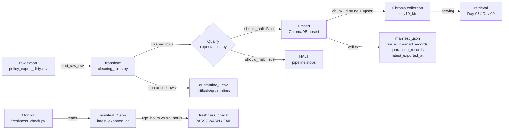

# Kiến trúc pipeline — Lab Day 10

**Nhóm:** Team 67  
**Cập nhật:** 2026-04-15

---

## 1. Sơ đồ luồng

**Điểm đo freshness:** `monitoring/freshness_check.py` đọc `latest_exported_at` từ manifest mới nhất, so sánh với `datetime.now(utc)`.  
**Run_id** được ghi vào manifest và metadata của mỗi vector trong Chroma.  
**Quarantine:** mỗi record bị loại ghi rõ `reason` ra `artifacts/quarantine/quarantine_<run_id>.csv`.

---

## 2. Ranh giới trách nhiệm

| Thành phần | Input | Output | File |
|------------|-------|--------|------|
| Ingest | `data/raw/policy_export_dirty.csv` | `List[Dict[str, str]]` (raw rows) | `etl_pipeline.py` → `transform/cleaning_rules.py::load_raw_csv` |
| Transform | raw rows | cleaned rows + quarantine rows | `transform/cleaning_rules.py::clean_rows` |
| Quality | cleaned rows | `List[ExpectationResult]`, `should_halt: bool` | `quality/expectations.py::run_expectations` |
| Embed | cleaned rows + run_id | vectors in ChromaDB + manifest JSON | `etl_pipeline.py::_embed_step` |
| Monitor | manifest JSON | freshness status (PASS/WARN/FAIL) | `monitoring/freshness_check.py` |

---

## 3. Idempotency & rerun

Strategy: **upsert theo `chunk_id` + prune chunk cũ**.

`chunk_id` được tạo bằng SHA-256 của `{doc_id}|{chunk_text}|{seq}` (16 ký tự hex). Cùng nội dung → cùng ID → Chroma upsert không tạo duplicate.

Prune logic (mỗi lần embed):
1. Lấy toàn bộ IDs hiện tại trong collection (`col.get(include=[])`)
2. Tính `drop = prev_ids - new_ids`
3. `col.delete(ids=drop)`: Xóa vector của các chunk không còn trong batch mới

Kết quả: rerun 2 lần với cùng input → collection giống hệt nhau, không có vector duplicate.

**Lưu ý quan trọng:** Nếu chạy `--no-refund-fix`, chunk "14 ngày" có `chunk_id` khác với chunk "7 ngày" (hash khác). Khi fix lại, chunk cũ sẽ bị prune, nhưng chỉ nếu run tiếp theo embed thành công. Nếu pipeline bị HALT (validate fail), prune không chạy và chunk dirty vẫn tồn tại trong Chroma.

---

## 4. Liên hệ Day 09

Day 10 và Day 09 dùng **ChromaDB riêng biệt**:

- Day 10: `day10/lab/chroma_db` — collection `day10_kb` — corpus từ `policy_export_dirty.csv`
- Day 09: `day09/lab/chroma_db` — corpus từ `data/docs/*.md` / `*.pdf`

Day 10 mô phỏng lớp **data pipeline** (ingest → clean → validate → embed). Day 09 mô phỏng lớp **retrieval & agent** (query → retrieve → rerank → generate). Trong hệ thống thực tế, Day 10 pipeline sẽ publish cleaned corpus vào shared Chroma mà Day 09 retrieval đọc.

---

## 5. Rủi ro đã biết

| Rủi ro | Mô tả | Giảm thiểu |
|--------|-------|-----------|
| Freshness SLA | `latest_exported_at` cố định ở 2026-04-10 luôn FAIL 24h SLA trong lab | Ghi nhận trong runbook; không phải lỗi thật |
| Prune chỉ chạy khi pipeline không HALT | Nếu validate HALT, chunk dirty vẫn trong Chroma từ run trước | Luôn chạy `etl_pipeline.py run` (không `--skip-validate`) sau khi fix |
| chunk_id collision | SHA-256 truncated 16 chars, collision probability rất thấp nhưng không bằng 0 | E8 `unique_chunk_id` expectation phát hiện nếu xảy ra |
| doc_id allowlist tĩnh | Thêm doc mới phải cập nhật `ALLOWED_DOC_IDS` trong `cleaning_rules.py` | Document trong `docs/data_contract.md` |
